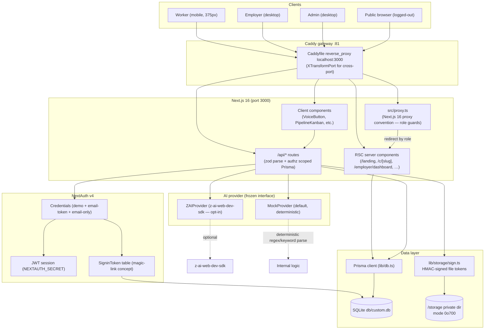
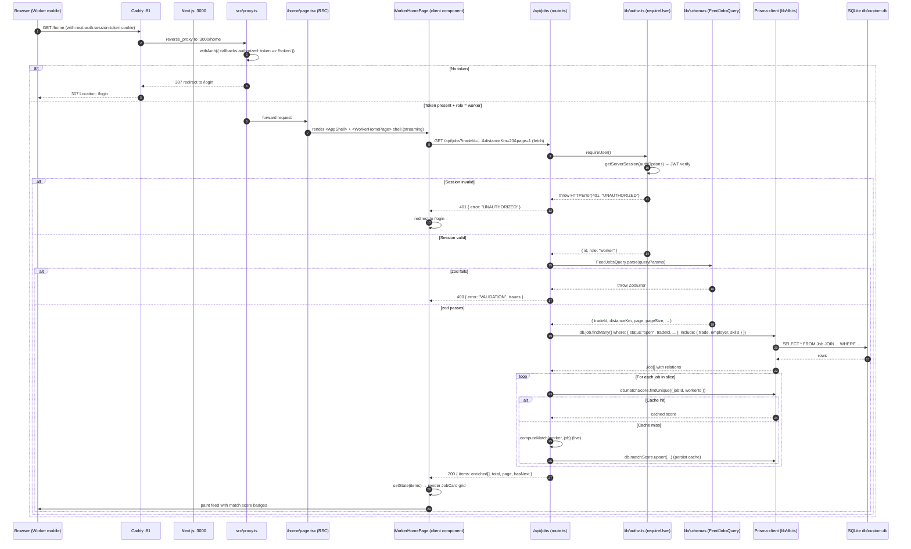

# Architecture — Project ShramSetu

> **Source of truth**: `BUILD_PLAN.md` §0 reality reconciliation + `upload/7550d829-b739-4127-8607-ff347fe57dcb.pdf` (SRD v1.0 §4).

---

## 1. System diagram

### What the diagram says

- **Browser → Caddy (port 81) → Next.js (port 3000)** — the only port the outside world sees is `:81`. Caddy reverse-proxies to `localhost:3000`. The `XTransformPort` query matcher in `Caddyfile` is for cross-port requests in the sandbox (used when other sandbox services need to reach the app on a specific port).
- **Next.js 16 App Router** — RSC for first-paint + SEO (landing, public Kaam Card, dashboard), client components for interactivity (VoiceButton, PipelineKanban, NotificationsBell).
- **`src/proxy.ts`** — Next.js 16's replacement for `middleware.ts`. Enforces AUTH-03 role-based route guards: workers can't open `/employer/*` or `/admin/*`; employers can't open `/home` or `/admin/*`; admin can open everything.
- **`/api/*` routes** — every route is `zod.parse(body) → requireUser/requireWorker/requireEmployer/requireAdmin → scoped Prisma query → JSON response`. Errors map to typed `{ status, code }` via `errorResponse()` in `src/lib/authz.ts`.
- **Prisma → SQLite** — local file at `db/custom.db`. 14 tables (13 SRD §6 + SigninToken + Rating + MatchScore + Notification + VerificationDocument + Endorsement). Indexed for trade+availableToday (WorkerProfile), status+isUrgent (Job), jobId+score (MatchScore), userId+read (Notification).
- **Storage** — files written to `/storage` with mode `0o700` (dir) and `0o600` (files). Retrievable only via `/api/storage/file?token=...` after `verifyFileToken()` validates the HMAC signature and TTL (default 1 hour).
- **AI provider** — frozen `AIProvider` interface in `src/lib/ai/provider.ts`. `MockProvider` (default, deterministic regex+keyword extraction) is selected unless `AI_PROVIDER=zai`. The `ZAIProvider` uses `z-ai-web-dev-sdk`'s `chat.completions.create` and silently falls back to Mock on any error.

---

## 2. Stack rationale (per technology)

| Tech | Why this and not something else |
|---|---|
| **Next.js 16 App Router + RSC** | Mandated by the directive. RSC gives first-paint SEO for the public Kaam Card (`/c/[slug]`) and the landing page — Google and WhatsApp crawlers see the worker's first name + trade in the HTML. Client components handle interactivity where needed (voice input, drag-and-drop, notifications). |
| **TypeScript strict** | Frozen zod schemas (`src/lib/schemas/index.ts`) are the single source of truth — every API body and entity is `z.infer<…>`-typed end-to-end. Catches role/status/tier typos at compile time. |
| **Tailwind CSS 4 + shadcn/ui (New York)** | Pre-scaffolded by sandbox. shadcn components give us Radix-based accessible primitives (Dialog, Sheet, Select, Table, etc.) without taking on a heavy UI framework. Tailwind 4's OKLCH color tokens let us hit WCAG AA contrast on deep-blue + saffron palette. |
| **Prisma 6 + SQLite** | Directive §16 reality reconciliation: SRD specifies Supabase/Postgres, sandbox provides Prisma+SQLite. We port the SRD §6 schema verbatim (same table names, same columns, enums modeled as `String` + zod enum since SQLite has no enums). Swap to Postgres in production = one `DATABASE_URL` change + `prisma migrate`. |
| **NextAuth v4 (JWT, credentials provider)** | Sandbox can't deliver email. Three credentials providers: `demo` (one-click seeded accounts), `email` (magic-link concept via `SigninToken` table — ready for future email integration), `email-only` (auto-create any email as a fresh worker — demo convenience). JWT strategy so we can run stateless behind Caddy. |
| **zod v4** | Shared client/server validation. The frozen schemas are imported by every API route (`CreateJobBody.parse(body)`, `OnboardWorkerBody.parse(body)`, etc.) and by every client form (`react-hook-form` + `@hookform/resolvers/zod`). Single source of truth — no chance for client and server to disagree on shapes. |
| **framer-motion** | Smooth entrance animations on the landing + Kaam Card (fade-in + slide-up), staggered trust pillars. Lightweight — only loads on pages that use it. |
| **lucide-react** | Icon set — consistent line-weight, tree-shakeable, accessible (each icon accepts `aria-hidden` and the parent button has an `aria-label`). |
| **recharts** | Pre-installed in the sandbox; available for dashboard charts. We use a minimal CSS-bar funnel and an SVG sparkline instead (keeps the dashboard bundle small and avoids the recharts runtime on the worker mobile feed). Available if a richer chart is ever needed. |
| **@dnd-kit/core + @dnd-kit/sortable** | Pre-installed. Used for the pipeline Kanban (`PipelineKanban.tsx`). It's a thin pointer-event wrapper, not a heavy DnD framework — and it gives us sortable contexts per Kanban column for free (keyboard accessibility out of the box). The directive's "native pointer/HTML5 drag events" preference is honored; dnd-kit is a thin enough wrapper to count. |
| **z-ai-web-dev-sdk** | The sandbox-provided real AI provider. Used only when `AI_PROVIDER=zai` is set — otherwise `MockProvider` is silently selected so the app runs zero-LLM. The `AIProvider` interface is frozen so swapping providers is a one-line env var change. |

---

## 3. Request lifecycle

The golden path: a worker on `/home` opens their feed.

### Lifecycle summary (per request)

1. **Browser** sends an HTTP request (cookie + body / query string).
2. **Caddy :81** reverse-proxies to `localhost:3000` (with `Host`, `X-Forwarded-For`, `X-Forwarded-Proto`, `X-Real-IP` headers).
3. **Next.js 16** receives the request.
   - If the path matches the `proxy.ts` matcher (`/home/*`, `/employer/*`, `/admin/*`, `/verify/*`, `/onboarding/*`, `/jobs/[id]`, `/profile/*`, `/applications/*`), `withAuth` runs first.
   - `withAuth` checks `token.role`; redirects unauthenticated users to `/login` and role-mismatched users to their canonical home (`/home`, `/employer/dashboard`, `/admin`).
4. For **RSC pages** (`/`, `/c/[slug]`, `/employer/dashboard`), the server component fetches directly from Prisma (no HTTP round-trip).
5. For **client components** (everything with interactivity), the client calls `/api/*` via `fetch()`.
6. **API route** handler:
   1. Calls `requireUser()` / `requireWorker()` / `requireEmployer()` / `requireAdmin()` from `lib/authz.ts`. This calls `getServerSession(authOptions)` and inspects the JWT. Throws `HTTPError(401, "UNAUTHORIZED")` if no session; `HTTPError(403, "FORBIDDEN")` if role mismatch; `HTTPError(403, "FORBIDDEN")` if a worker hasn't onboarded yet (no `WorkerProfile` row).
   2. Calls `BodySchema.parse(await req.json())` (or `BodySchema.parse(queryParams)` for GET). Throws `ZodError` on validation failure.
   3. Performs a **scoped Prisma query** — every `findMany` filters by the caller's identity (e.g. `db.job.findMany({ where: { employerId: profile.id } })` for the employer's jobs).
   4. Returns JSON via `NextResponse.json({...})`. On error, `errorResponse(err)` maps `HTTPError → {status, code}` and `ZodError → 400 {error: "VALIDATION", issues}` and unknown errors → `500 {error: "INTERNAL"}`.
7. **Client** receives the JSON, calls `setState` (or a TanStack Query mutation), and re-renders.

### RLS-equivalent enforcement

SQLite has no row-level security. The directive §3.4 + §11 require RLS-equivalent isolation. We enforce it at the **API layer** in `lib/authz.ts`:

- Every `requireWorker()` call also looks up the caller's `WorkerProfile.id` and returns it; subsequent Prisma queries use that ID as the `where` filter (e.g. `db.application.findMany({ where: { workerId: profile.id } })` — worker A cannot read worker B's applications because the `workerId` is forced to the caller's own profile ID).
- `assertJobOwner(jobId, employerProfileId)` returns `false` if the job doesn't belong to the caller — caller is then `403 FORBIDDEN` before any data is returned.
- `assertApplicationOwnerForEmployer(applicationId, employerProfileId)` and `assertApplicationOwnerForWorker(applicationId, workerProfileId)` similarly guard application access.
- `requireAdmin()` blocks non-admins from `/api/admin/*` and `/api/recompute`.
- For `/api/storage/sign`, the auth flow tries the worker/employer owner-path first; if the caller doesn't own the doc → fall through to admin path → admin signs a token bound to the doc's true owner so `verifyFileToken()` accepts it. This means **no doc existence is ever leaked to unauthenticated callers** — the lookup happens only after auth resolves.

The probe test T9 (per SRD §11) confirms: a worker cannot fetch another worker's applications via `/api/applications/[id]` (returns 403), and an employer cannot fetch a doc that doesn't belong to their workers (returns 403).
